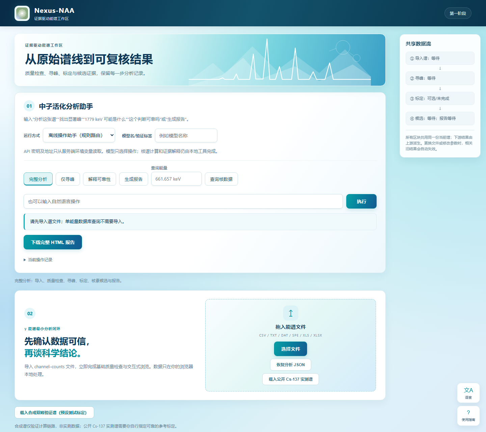

# Nexus-NAA · V1.3


[English](README_EN.md)

> 面向中子活化分析的证据驱动智能分析平台与 Agent Skill

本地 γ 能谱分析原型：读谱 → QC → 寻峰 → 用户参考点标定 → 核素候选与证据 → HTML 报告。自然语言入口、MCP 工具和手动按钮共用同一套确定性科学工作流。

Nexus-NAA is an evidence-driven gamma-spectrum analysis agent for neutron activation analysis (NAA). It supports spectrum import and QC, peak finding, user-referenced energy calibration, nuclide candidate evidence, and traceable reports through a local workbench, MCP tools, and an HTTP API. Matches are candidates, not confirmed identifications; quantitative analysis requires further experimental calibration and uncertainty controls.

> 本项目用于研究、教学和方法验证，不是经认证的实验室测量系统。数据库命中只构成候选证据；当前版本不包含效率刻度、照射/衰变修正、完整不确定度或经验证的元素定量，不能独立用于安全、监管或商业检测结论。V1.3 将宽容差候选召回与窄支持窗分离，增加谱线独立性审查、SHA-256 分析指纹和可执行识别质量门槛；分析 JSON 的格式版本 0.4 保持不变。

## 智能体页面



## 更新日志

- **V1.3 视觉更新（2026-10-01）**：新增“从原始谱线到可复核结果”横幅和谱线装饰，采用深蓝页眉、青蓝渐变按钮与浅色卡片；调整桌面共享数据流位置、移动端布局、键盘焦点和减少动态效果设置。中英页面截图已重新生成。
- **V1.3 页面更新（2026-10-01）**：按完整分析、仅寻峰、可靠性复核、报告和核数据查询切换工作区；寻峰参数与说明随检测模式显示，隐藏参数不参与当前模式输入。简化页面标题和阶段标签，更新中英界面文案及用户提供核数据的来源名称。替换为用户提供的绿色原子图标，去除外部白色背景，并更新页眉、浏览器图标与最新页面截图。
- **V1.3（2026-09-24）**：宽容差用于保留候选，窄支持窗与谱线独立性审查决定能否标为 `supported`；新增规范化 JSON 的 SHA-256 分析指纹和识别质量失败门槛。页面截图已更新为 V1.3 实际运行界面。
- **V1.2**：报告前重建并核对完整核素证据；用 Ajv 8 在 CLI、HTTP、MCP 入口执行 JSON Schema；增加同一快照报告、宿主行为评测与三系统参考谱对照。
- **V1.1**：建立 Skill 决策流程、确定性工具、结构化输入输出和结果一致性验证。
- **V1.0**：发布本地能谱工作台、MCP 接入、双语文档和基础科学分析流程。

各版本的验证范围见 [V1.3 核对](docs/SKILL_V1.3_VERIFICATION.md)、[V1.2 核对](docs/SKILL_V1.2_VERIFICATION.md)和 [V1.1 核对](docs/SKILL_V1.1_VERIFICATION.md)。分析 JSON 格式版本仍为 `0.4`。

## V1.3 能力

- CSV/TXT/DAT、ORTEC/GammaVision 文本 SPE、XLS/XLSX 统一导入与基础 QC；
- 局部泊松显著性寻峰、实验性 SNIP 本底和相邻双峰 Gaussian 拟合；
- 仅使用用户或实验提供参考点的线性能量刻度；
- 版本固定、逐条标注资格的 γ 谱线候选与伴随峰证据；
- HTML、JSON、CSV 可追溯输出，以及工作区 JSON 恢复；
- 离线规则助手、可选模型适配层、MCP、HTTP API 和本地可视化工作台。
- 十个可组合的确定性工具、Ajv 8 运行时 JSON Schema、四级核素状态与六种谱线状态；
- 报告前从谱线结果重建整个核素证据对象，逐字段检查输入哈希、数值、说明、来源、标定评估和警告；
- 首选对同一份已验证快照生成报告，并提供六场景宿主行为评测器与三系统参考谱对照。
- 候选可在用户容差内完整保留，但只有位于 `min(容差, FWHM/2 + 标定 RMSE)` 支持窗、标定参考能区内且通过独立性检查的观测才可贡献 `supported`；失败原因逐条保留。
- 分析快照使用规范化 JSON 的 SHA-256 指纹；固定参考谱评测对非标签 `supported`、无依据确定结论及 Top-1/Top-3 保留设置自动失败门槛。

## 运行
要求 Node.js 18+ 和 pnpm；先执行 `pnpm install --frozen-lockfile` 安装锁定的 Ajv 8，再运行 `node server.mjs`，浏览器打开 http://127.0.0.1:4173 。停止用 Ctrl+C。端口占用时可在 PowerShell 先执行 `$env:PORT='4185'`，再启动并打开对应端口。关闭旧版本服务以免看到旧页面。
完整语法检查与测试：`node scripts/check.mjs`。仅运行 Skill 契约场景：`node scripts/run-skill-conformance.mjs`；复核三份标准谱：`node scripts/validate-reference-spectra.mjs`；宿主行为评分：`node scripts/evaluate-host-behavior.mjs <transcript.json>`；三系统识别对照：`node scripts/evaluate-identification.mjs`。

## 安装为 Agent Skill

克隆仓库后，可直接把整个仓库作为 Skill 使用；`SKILL.md` 是入口，应用、MCP 服务、核数据、文档和测试都包含在同一目录中。

Skill 适合 γ 能谱导入/QC、寻峰、用户参考点标定、单能量谱线查询、核素候选证据和可追溯报告；不适合 XRF、NMR、质谱、医学诊断、安全/监管判定，或缺少效率与实验控制时的活度和元素定量。模型只负责编排工具和解释证据，不得生成标定点或改写数值。完整决策树、输入要求、状态定义和数据政策见 [`references/`](references/)。

一次安装到所有支持的用户级目录：

```bash
python scripts/install.py --tool all --scope user
```

也可将 `all` 换成 `codex`、`claude`、`workbuddy`、`codebuddy`、`qoder`、`zcode` 或 `deepseek-harness`。项目级安装示例：

```bash
python scripts/install.py --tool codex --scope project --project-root /path/to/project
```

据团队成员反馈，Skill 已在 Claude Code 和 Qoder 上完成安装并成功调用。这是两个宿主的实际使用反馈；尚未进行统一测试条件下的跨模型行为评估。

安装器默认不覆盖已有副本；显式使用 `--force` 时，会先创建带时间戳的备份。安装或更新后请重启/刷新 Agent。各工具目录和 MCP 配置见[智能体接入说明](docs/AGENT_INTEGRATION.md)。即使不使用 Agent，仍可直接运行上面的本地可视化工作台。

## 使用
点击“载入合成双峰验证谱”，输入“分析这张谱”，可验证双峰候选与伴随支持，再下载 HTML 报告。可用“保存分析 JSON”保存当前工作区，并从导入区域“恢复分析 JSON”。合成谱的预设 E=C 仅来自生成公式，不是实验标定。公开 Cs-137 实测谱未提供可靠参考点时只读谱和寻峰，不自动推断标定。
支持 CSV/TXT/DAT、ORTEC/GammaVision 文本 SPE，以及 XLS/XLSX。分隔文本须为两列 channel,counts，可选同名首行表头；SPE 读取 `$DATA:` 通道范围和对应计数；Excel 从各工作表选择数值行最多的前两列。通道须非负递增整数，计数须有限非负。间断通道可查看，不允许寻峰。QC PASS 仅表示基础格式通过。

XLS/XLSX 优先使用 Windows 上已安装的 Microsoft Excel：服务端禁用宏和更新链接、只读打开上传的临时副本。若 Excel COM 因登录会话或安装状态不可用，则自动切换到项目固定版本的 xlrd/openpyxl 只读解析器；转换完成后立即删除上传副本。

页面右侧固定的“共享数据流”进度栏显示当前谱、峰列表、标定和候选状态。所有功能区共用同一个 Workspace；更换文件或修改上游参数会自动清除相关下游结果。

寻峰默认采用局部泊松显著性，避免最高强峰把全谱统一阈值抬高而漏掉弱峰；旧版全谱比例模式仍可对照。另提供实验性的SNIP本底模式和相邻峰双Gaussian局部拟合。SNIP基于LLS变换与递减裁剪窗口，用户标准谱回归建议以8σ作为起点；它并未在所有谱上优于默认模式。Gaussian结果保存在峰记录的 `overlapFit` 中，只处理已经找到的相邻双峰，不自动把宽峰拆成多个峰。

能量标定保留手动输入，同时提供“已知标准源辅助填入”：选择实验中确知的标准核素后，程序从当前谱寻峰并提出通道—参考能量配对，只填入、不自动应用。未知谱不能靠两个峰唯一反推出核素和线性标定；两点零 RMSE 也不是准确性验证。活动核数据为29种实际发射核素、81条谱线：58条来自 IAEA 2008 固定报告并逐页核对，23条来自用户提供的数据资料并已用 IAEA、LNHB/DDEP 和 NNDC 资料独立审查。原标为 U-238 的 63.29/92.38 keV 线已按实际发射者改为 Th-234，仅在平衡条件有依据时可间接指示 U-238；不冒充完整或最新核数据库。

## 助手
默认离线操作助手是规则路由，不是大模型。支持分析、寻峰、单能量查询、可靠性说明、报告。
模型入口采用统一适配层，支持 Ollama、OpenAI-compatible、Anthropic、Gemini，也可继续添加 Provider。模型只选择白名单操作；核数据、计算及证据解释均来自本地代码。

服务端配置（只设置需要使用的一种，不要写入仓库）：

- OpenAI-compatible：`NAA_MODEL_BASE_URL`（例如以 `/v1` 结尾）和 `NAA_MODEL_API_KEY`；远程地址强制 HTTPS。
- Anthropic：`ANTHROPIC_API_KEY`。
- Gemini：`GEMINI_API_KEY`。
- Ollama：固定使用本机 `127.0.0.1:11434`，无需密钥。

“手动真实模型验证”会生成完整提示，可交给当前对话模型或任意其他模型，再把原始 JSON 回复粘贴回应用。应用验证并执行该回复，但不能认证粘贴内容的模型来源，因此审计记录明确标为 `user_pasted_not_authenticated`。自动 API 调用会标为 `server_api`。

## 输出与范围
HTML 包含完整谱、QC、标定、峰表、候选理由、来源、证据链、参数和警告；JSON 包含原始计数和文件字节 SHA-256，并可重新导入恢复分析；恢复时只采纳谱、标定和参数，峰与候选由当前版本重新计算，不信任文件中缓存的派生结论。CSV 为峰表。JSON作为机器交换格式保持稳定字段名，不随界面语言改变。
[四阶段整体核对](docs/acceptance-matrix.md) · [方法限制](docs/methods.md) · [核数据说明](data/NUCLEAR_DATA.md) · [公开实测谱来源](data/SOURCES.md)
[智能体、MCP 与 HTTP API 接入](docs/AGENT_INTEGRATION.md)
[方法与数据改进依据](docs/research-basis.md)
[用户标准谱回归结果](docs/REFERENCE_VALIDATION.md) · [ENSDF可复现导入流程](docs/ENSDF_PIPELINE.md)
[Skill V1.3 完整性核对](docs/SKILL_V1.3_VERIFICATION.md) · [V1.2 历史核对](docs/SKILL_V1.2_VERIFICATION.md) · [宿主行为评测](docs/HOST_BEHAVIOR_EVAL.md) · [识别对照](docs/IDENTIFICATION_EVALUATION.md) · [固定数据与方法来源登记](references/source-register.md)
这是简化四阶段原型；可选的相邻双峰局部拟合仍属实验功能，不含完整不确定度评定、效率刻度及元素定量，不代表原始大型平台方案全部完成。

## 开源与数据说明

代码以 [MIT License](LICENSE) 发布。仓库中的核数据和参考谱保留各自来源、资格与限制说明；引用或再分发前请分别检查[data/NUCLEAR_DATA.md](data/NUCLEAR_DATA.md)、[data/SOURCES.md](data/SOURCES.md)及原始来源条款。提交 issue 时不要上传未脱敏的实验记录、API Key 或受限制数据。

## 作者与反馈

twinkle-air 邮箱：[twinkleair369@gmail.com](mailto:twinkleair369@gmail.com) 或者 [twinkle-air@qq.com](mailto:twinkle-air@qq.com)
